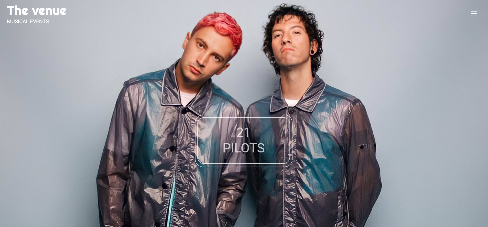
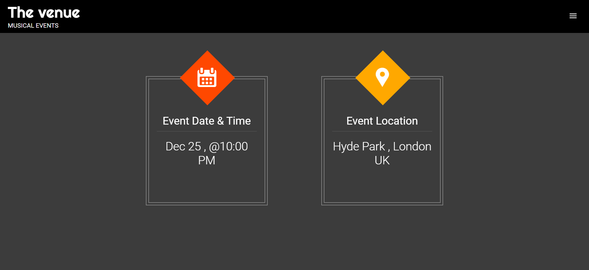
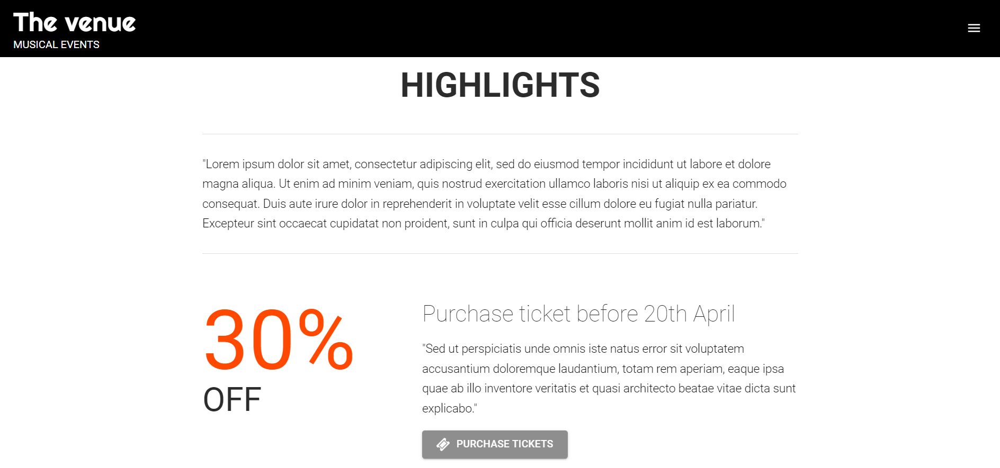
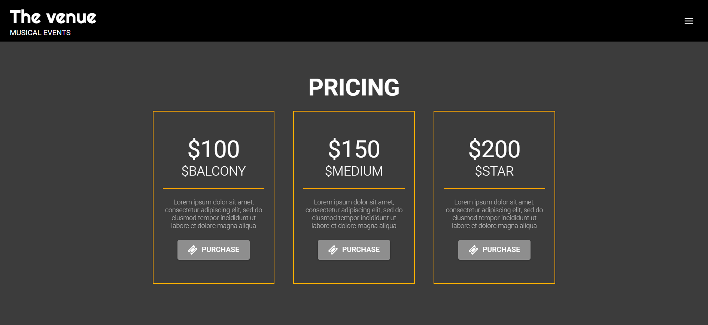
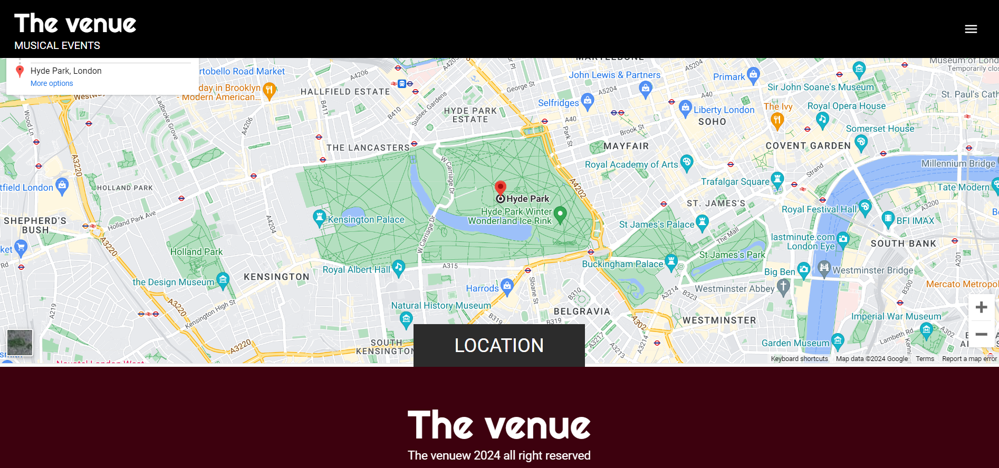

# The Venue - Musical Events Website
https://charming-muffin-5d5c7b.netlify.app/

## Introduction

**Product Title**: The Venue - Musical Events Website

**Product Description**: The Venue is a musical events website where users can explore and discover upcoming musical events. It provides information about various musical events, including event details, venue location, and ticket purchasing options.

**User Story**: As a user, I want to explore upcoming musical events so that I can plan my entertainment activities and discover new artists and performances.

## Project Overview

The Venue is a React-based web application developed for exploring and discovering musical events. It utilizes various libraries and technologies to enhance the user experience and provide rich features.

### Technologies Used:

- React: Used for building the front-end interface and managing state.
- React Scroll: Implemented for smooth scrolling effects within the application.
- Material UI: Utilized for UI components and styling.
- React Awesome Reveal: Integrated for animations to enhance user experience.
- React Slick: Employed for creating carousel components to showcase events.
- Material UI Icons: Used for adding icons throughout the application.

### Features:

- Interactive interface for exploring musical events.
- Use of React components and props for modular and reusable code.
- Implementation of useState and useEffect hooks for managing state and side effects.
- Future implementation plans include making the application mobile-friendly and integrating with the Ticketmaster affiliate program for ticket purchasing.Integration of data from external APIs for event details and information.

## File Structure

- `src/components`: Contains React components used throughout the application.
- `src/styles`: Contains CSS files for styling components.
- `src/App.js`: Main component handling routing and overall application structure.
- `public/index.html`: The main HTML file serving as the entry point of the application.

## Deployment

Live URL: https://charming-muffin-5d5c7b.netlify.app/
GitHub Repository: https://github.com/Costea47/the-venue

## License

MIT License

## Screenshots

---
